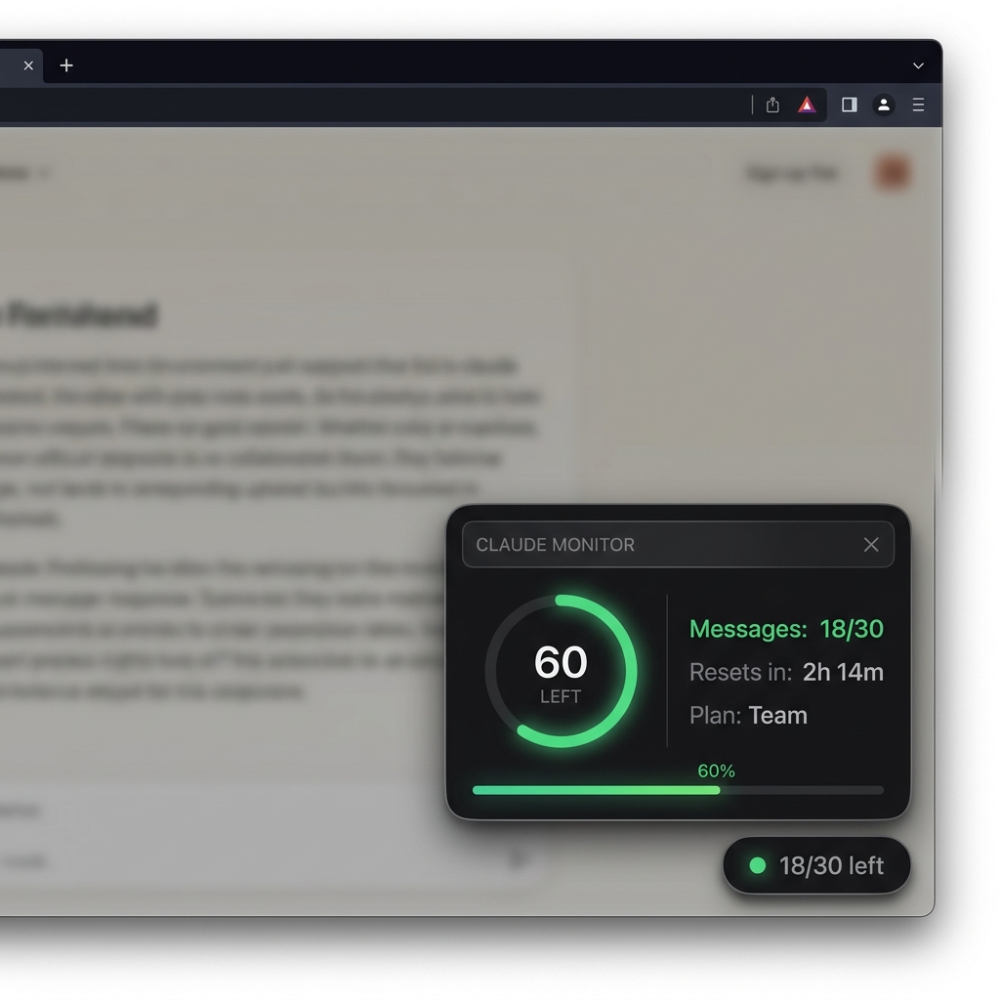
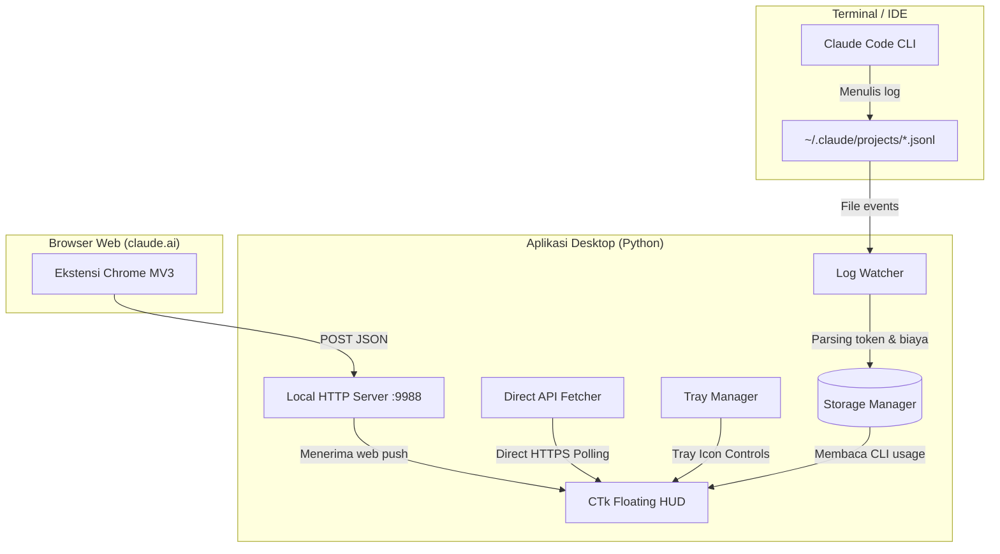

# Claude Token Monitor 🚀

[](https://opensource.org/licenses/MIT)
[](https://www.python.org/)
[](https://www.microsoft.com/windows)

**Claude Token Monitor** adalah aplikasi utilitas lokal (local-first) yang dirancang untuk memantau sisa kuota Claude Anda secara real-time. Aplikasi ini mendukung pemantauan token **Claude Code CLI** (di terminal/IDE) dan kuota pesan **Claude.ai Web App** (di browser), lalu menampilkannya dalam floating widget desktop bergaya Glassmorphic yang elegan dan ikon System Tray Windows.

*Read this documentation in [English](README.md).*

---

## 📸 Tampilan Antarmuka



* Widget melayang transparan modern yang selalu di atas (`always-on-top`).
* Kode warna dinamis: **Hijau** (kuota aman), **Kuning** (mulai menipis), dan **Merah** (hampir habis).
* Mode Ringkas (Collapse): Cukup klik `−` untuk menyembunyikan detail widget ke bentuk pill kecil.
* Integrasi system tray dengan kendali penuh (Setup Key, Sinkronisasi Manual, Show/Hide).

---

## ✨ Fitur Utama

- **Strategi Sinkronisasi Ganda:**
  - **Mode Mandiri (Standalone):** Pemanggilan API Claude langsung dari widget menggunakan cookie `sessionKey` yang disimpan secara aman di lokal.
  - **Sinkronisasi Ekstensi Browser:** Ekstensi Chrome MV3 yang mendeteksi penggunaan web Anda secara otomatis dan mengirimkannya ke widget.
- **Glassmorphic Floating HUD:** Widget transparan modern lengkap dengan ring progress sisa kuota, durasi waktu reset, dan status sinkronisasi.
- **Ingat Posisi (Draggable):** Posisi widget dapat digeser secara bebas di layar, dan koordinat terakhir akan disimpan secara otomatis untuk startup berikutnya.
- **Estimasi Biaya Claude CLI:** Membaca token Input, Output, Cache Write, dan Cache Read secara real-time dan mengestimasikan biayanya (USD) berdasarkan tarif resmi Claude 3.5 Sonnet.
- **Proteksi Instansi Tunggal (Singleton):** Mekanisme socket internal mencegah duplikasi proses aplikasi yang dapat menyebabkan penumpukan jendela (*window spam*) di layar atau tray icon.
- **100% Aman & Privasi Terjaga:** Seluruh data disimpan lokal (`usage_data.json`). Server HTTP lokal di-bind eksklusif hanya untuk alamat `127.0.0.1` (localhost).

---

## 🛠️ Arsitektur & Cara Kerja



1. **Log Watcher (CLI):** Membaca file log `.jsonl` di direktori `%USERPROFILE%\.claude\projects\` menggunakan pustaka watchdog tanpa memerlukan koneksi internet.
2. **Local HTTP Server:** Berjalan secara senyap pada port `9988` (localhost). Ekstensi Chrome mem-POST data sisa kuota ke server ini sesaat setelah Anda mengirim pesan di Claude.ai.
3. **Direct Fetcher (Standalone):** Membuat sesi HTTP request yang menyerupai browser menggunakan cookie `sessionKey` untuk melewati proteksi Cloudflare dan mengambil sisa kuota organisasi secara langsung.

---

## 🚀 Panduan Instalasi & Penggunaan

### 1. Instalasi Aplikasi Desktop
1. Pastikan Anda memiliki **Python 3.10+** terinstal di komputer.
2. Unduh atau salin folder proyek ini ke direktori kerja Anda.
3. Instal semua pustaka dependensi:
   ```bash
   pip install -r requirements.txt
   ```
4. Jalankan aplikasi:
   ```bash
   python -m app.main
   ```
   *(Pengguna Windows cukup klik dua kali berkas `run.bat` untuk menginstal pustaka dan langsung menjalankan widget.)*

### 2. Mode Mandiri (Setup Session Key)
Untuk mengizinkan aplikasi desktop membaca kuota Anda secara langsung tanpa harus membuka ekstensi browser:
1. Buka [claude.ai](https://claude.ai) di Chrome/Brave/Edge dan pastikan Anda sudah masuk (login).
2. Tekan `F12` untuk membuka DevTools.
3. Buka tab **Application** -> **Cookies** -> `https://claude.ai`.
4. Cari cookie bernama `sessionKey` dan salin nilainya (diawali dengan `sk-ant-sid...`).
5. Klik kanan ikon **C** pada system tray Windows Anda (kanan bawah) lalu pilih **Setup Session Key**.
6. Tempel (paste) nilai kunci tersebut dan klik **OK**. Widget akan langsung sinkron secara otomatis.

### 3. Setup Ekstensi Browser (Opsional)
Untuk pembaruan instan setiap kali Anda berkirim pesan di browser:
1. Buka Chrome atau browser berbasis Chromium lainnya (Edge, Brave).
2. Pergi ke halaman ekstensi di `chrome://extensions`.
3. Aktifkan **Developer Mode** (kanan atas).
4. Klik **Load Unpacked** (kiri atas) dan pilih folder `extension` dari folder proyek ini.
5. Muat ulang (reload) halaman [claude.ai](https://claude.ai) Anda.

---

## 🔒 Keamanan & Privasi

* **Penyimpanan Lokal:** Seluruh data token dan penggunaan Anda hanya disimpan di folder lokal komputer Anda (`app/usage_data.json`).
* **Proteksi Jaringan:** Server API lokal hanya mendengarkan koneksi internal `127.0.0.1`. Jaringan Wi-Fi/LAN eksternal tidak dapat mengakses server monitor Anda.
* **Isolasi Cookie:** Ekstensi browser tidak dapat membaca atau mengirimkan `sessionKey` Anda ke server lokal. Cookie `sessionKey` untuk widget disimpan terpisah secara lokal di `app/config.json` (yang juga diabaikan oleh Git).

---

## 🤝 Kontribusi

Kontribusi dari komunitas sangat dihargai! Jika Anda memiliki saran perbaikan visual, optimasi logwatcher, atau penyesuaian platform:
1. Fork repositori ini.
2. Buat branch baru (`git checkout -b feature/AmazingFeature`).
3. Lakukan commit perubahan (`git commit -m 'Add some AmazingFeature'`).
4. Push ke branch Anda (`git push origin feature/AmazingFeature`).
5. Buka Pull Request.

---

## 📄 Lisensi

Proyek ini dilisensikan di bawah Lisensi MIT - lihat berkas [LICENSE](LICENSE) untuk informasi lebih lanjut.

---

## ⚠️ Penyangkalan (Disclaimer)

Aplikasi ini adalah alat bantu tidak resmi dan tidak berafiliasi, terkait, disahkan, didukung oleh, atau dengan cara apa pun terhubung secara resmi dengan Anthropic, PBC atau anak perusahaan serta afiliasinya. Claude, Claude Code, dan Anthropic adalah merek dagang terdaftar dari Anthropic, PBC.

