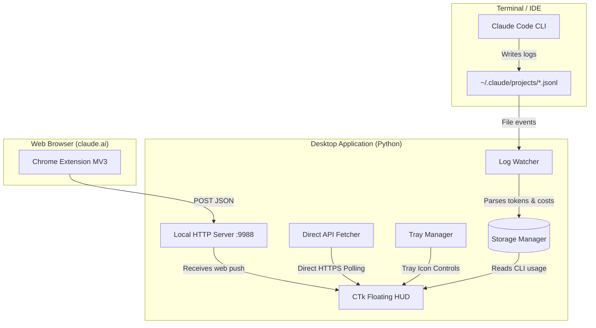

# Claude Token Monitor 🚀

[](https://opensource.org/licenses/MIT)
[](https://www.python.org/)
[](https://www.microsoft.com/windows)

**Claude Token Monitor** is a local-first utility designed to help developers monitor their Claude usage in real-time. It monitors both **Claude Code CLI** token consumption (via local logs) and **Claude.ai Web App** quota (via direct API queries or a companion Chrome Extension), rendering them in a beautiful, glassmorphism-styled floating HUD on your Windows desktop.

*Baca dokumentasi ini dalam [Bahasa Indonesia](README.id.md).*

---

## 📸 Interface Preview


* Sleek, always-on-top transparent desktop HUD.
* Dynamic color states: **Green** (plenty left), **Amber** (getting low), and **Red** (almost empty).
* Collapse mode: Double-click or click `−` to collapse the HUD into a tiny title pill.
* System tray integration with quick controls (Setup Key, Sync Now, Show/Hide).

---

## ✨ Features

- **Double-Sync Strategy:**
  - **Standalone Mode:** Direct API polling from the desktop app using a saved `sessionKey` cookie.
  - **Browser Extension Sync:** A companion Chrome extension pushes live stats to the app when you send messages.
- **Always-on-Top Floating HUD:** A modern glassmorphism widget with a circular progress ring, remaining quota percentage, and reset timers.
- **Draggable & Remembers Position:** Drag the HUD anywhere on your screen. The coordinates are saved automatically for your next startup.
- **Claude Code CLI Integration:** Real-time token parsing (Input, Output, Cache Write, Cache Read) and USD cost estimation based on Claude 3.5 Sonnet pricing.
- **Single-Instance Protection:** Built-in TCP socket lock prevents duplicate processes and window/tray icon spam.
- **100% Private & Offline-First:** Your data stays locally (`usage_data.json`). The local API server binds exclusively to `127.0.0.1` (localhost).

---

## 🛠️ Architecture & How It Works



1. **Log Watcher (CLI):** Monitors files in `%USERPROFILE%\.claude\projects\` using a lightweight OS-native file system watcher.
2. **Local HTTP Server:** Binds to localhost port `9988`. Pushed JSON payloads from the extension update the widget instantly.
3. **Direct Fetcher (Standalone):** Uses requests sessions populated with user-specific `sessionKey` and standard browser cookies to bypass Cloudflare and query the Claude API.

---

## 🚀 Installation & Setup

### 1. Desktop App Installation
1. Ensure **Python 3.10+** is installed.
2. Clone this repository or copy the folders to your workspace.
3. Install dependencies:
   ```bash
   pip install -r requirements.txt
   ```
4. Run the app:
   ```bash
   python -m app.main
   ```
   *(Windows users can double-click `run.bat` to install dependencies and launch the app in one click.)*

### 2. Standalone Mode (Session Key Setup)
To allow the desktop app to query your quota directly without the extension running:
1. Open [claude.ai](https://claude.ai) in your Chrome/Brave/Edge browser and make sure you are logged in.
2. Press `F12` to open DevTools.
3. Go to **Application** -> **Cookies** -> `https://claude.ai`.
4. Find the cookie named `sessionKey` and copy its value (starts with `sk-ant-sid...`).
5. Right-click the **C** icon in your system tray and select **Setup Session Key**.
6. Paste the copied key and click **OK**. The widget will automatically sync!

### 3. Companion Browser Extension Setup (Optional)
To update the widget instantly whenever you send messages in your browser:
1. Open Chrome or any Chromium-based browser (Edge, Brave, Opera).
2. Go to `chrome://extensions`.
3. Enable **Developer Mode** (top-right corner).
4. Click **Load Unpacked** (top-left corner) and select the `extension` folder inside this project.
5. Open [claude.ai](https://claude.ai) and send a message. Your remaining quota will instantly sync.

---

## 🔒 Security & Privacy

* **Zero Cloud Sharing:** Your tokens, API queries, and usage statistics are strictly stored in `app/usage_data.json` on your local disk.
* **Localhost Lock:** The API server binds strictly to loopback IP `127.0.0.1`. Other devices on your local network cannot read your statistics.
* **Credential Isolation:** The browser extension does **not** handle or transmit your `sessionKey`. Standalone cookie storage is strictly written locally in `app/config.json` (which is excluded from Git tracking in `.gitignore`).

---

## 🤝 Contribution Guidelines

Contributions are welcome! If you'd like to improve the UI styling, support other platforms, or optimize CLI logging:
1. Fork the project.
2. Create your feature branch (`git checkout -b feature/AmazingFeature`).
3. Commit your changes (`git commit -m 'Add some AmazingFeature'`).
4. Push to the branch (`git push origin feature/AmazingFeature`).
5. Open a Pull Request.

---

## 📄 License

This project is licensed under the MIT License - see the [LICENSE](LICENSE) file for details.

---

## ⚠️ Disclaimer

This is an unofficial tool and is not affiliated, associated, authorized, endorsed by, or in any way officially connected with Anthropic, PBC or any of its subsidiaries or affiliates. Claude, Claude Code, and Anthropic are registered trademarks of Anthropic, PBC.

